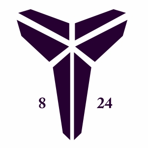

<!-- Improved compatibility of back to top link: See: https://github.com/othneildrew/Best-README-Template/pull/73 -->

<a name="readme-top"></a>

<!--
*** Thanks for checking out the Best-README-Template. If you have a suggestion
*** that would make this better, please fork the repo and create a pull request
*** or simply open an issue with the tag "enhancement".
*** Don't forget to give the project a star!
*** Thanks again! Now go create something AMAZING! :D
-->

<!-- PROJECT SHIELDS -->
<!--
*** I'm using markdown "reference style" links for readability.
*** Reference links are enclosed in brackets [ ] instead of parentheses ( ).
*** See the bottom of this document for the declaration of the reference variables
*** for contributors-url, forks-url, etc. This is an optional, concise syntax you may use.
*** https://www.markdownguide.org/basic-syntax/#reference-style-links
-->
<!-- [![Contributors][contributors-shield]][contributors-url] -->
<!-- [![Forks][forks-shield]][forks-url] -->

[![Stargazers][stars-shield]][stars-url]

<!-- [![Issues][issues-shield]][issues-url] -->
<!-- [![MIT License][license-shield]][license-url] -->

[![LinkedIn][linkedin-shield]][linkedin-url]

<!-- PROJECT LOGO -->
<br />
<div align="center">
  <a href="https://github.com/sammig6i/KobeScraper">
    
  </a>

<h3 align="center">KobeScraper</h3>

  <p align="center">
    A CV model that uses pose estimation and player tracking to generate unique Kobe Bryant highlights based on a user's chosen move.
    <!-- <br />
    <a href="https://github.com/github_username/repo_name"><strong>Explore the docs »</strong></a>
    <br /> -->
    <br />
    <a href="https://github.com/sammig6i/KobeScraper">View Demo</a>
    ·
    <a href="https://github.com/sammig6i/KobeScraper/issues">Report Bug</a>
    ·
    <a href="https://github.com/sammig6i/KobeScraper/issues">Request Feature</a>
  </p>
</div>

<!-- TABLE OF CONTENTS -->
<details>
  <summary>Table of Contents</summary>
  <ol>
    <li>
      <a href="#about-the-project">About The Project</a>
      <ul>
        <li><a href="#built-with">Built With</a></li>
      </ul>
    </li>
    <li>
      <a href="#getting-started">Getting Started</a>
      <ul>
        <li><a href="#prerequisites">Prerequisites</a></li>
        <li><a href="#installation">Installation</a></li>
      </ul>
    </li>
    <li><a href="#usage">Usage</a></li>
    <li><a href="#roadmap">Roadmap</a></li>
    <li><a href="#contributing">Contributing</a></li>
    <li><a href="#license">License</a></li>
    <li><a href="#contact">Contact</a></li>
    <li><a href="#acknowledgments">Acknowledgments</a></li>
  </ol>
</details>

<!-- ABOUT THE PROJECT -->

## About The Project

[![Product Name Screen Shot][product-screenshot]](https://example.com)

Here's a blank template to get started: To avoid retyping too much info. Do a search and replace with your text editor for the following: `github_username`, `repo_name`, `twitter_handle`, `linkedin_username`, `email_client`, `email`, `project_title`, `project_description`

<p align="right">(<a href="#readme-top">back to top</a>)</p>

### Built With (in progress)

- [![Ultralytics][Ultralytics]][Ultralytics-url]
- [![Poetry][Poetry.com]][Poetry-url]
- [![GCP][GCP]][GCP-url]
- [![Python][Python]][Python-url]

<p align="right">(<a href="#readme-top">back to top</a>)</p>

<!-- GETTING STARTED -->

## Getting Started

This is an example of how you may give instructions on setting up your project locally.
To get a local copy up and running follow these simple example steps.

### Prerequisites

This is an example of how to list things you need to use the software and how to install them.

- npm
  ```sh
  npm install npm@latest -g
  ```

### Installation

1. Get a free API Key at [https://example.com](https://example.com)
2. Clone the repo
   ```sh
   git clone https://github.com/sammig6i/KobeScraper.git
   ```
3. Install NPM packages
   ```sh
   npm install
   ```
4. Enter your API in `config.js`
   ```js
   const API_KEY = "ENTER YOUR API";
   ```

<p align="right">(<a href="#readme-top">back to top</a>)</p>

<!-- USAGE EXAMPLES -->

## Usage

Use this space to show useful examples of how a project can be used. Additional screenshots, code examples and demos work well in this space. You may also link to more resources.

_For more examples, please refer to the [Documentation](https://example.com)_

<p align="right">(<a href="#readme-top">back to top</a>)</p>

<!-- ROADMAP -->

## Roadmap

- [ ] Feature 1
- [ ] Feature 2
- [ ] Feature 3
  - [ ] Nested Feature

See the [open issues](https://github.com/github_username/repo_name/issues) for a full list of proposed features (and known issues).

<p align="right">(<a href="#readme-top">back to top</a>)</p>

<!-- CONTRIBUTING -->

## Contributing

Contributions are what make the open source community such an amazing place to learn, inspire, and create. Any contributions you make are **greatly appreciated**.

If you have a suggestion that would make this better, please fork the repo and create a pull request. You can also simply open an issue with the tag "enhancement".
Don't forget to give the project a star! Thanks again!

1. Fork the Project
2. Create your Feature Branch (`git checkout -b feature/AmazingFeature`)
3. Commit your Changes (`git commit -m 'Add some AmazingFeature'`)
4. Push to the Branch (`git push origin feature/AmazingFeature`)
5. Open a Pull Request

<p align="right">(<a href="#readme-top">back to top</a>)</p>

<!-- LICENSE -->

## License

Distributed under the MIT License. See `LICENSE.txt` for more information.

<p align="right">(<a href="#readme-top">back to top</a>)</p>

<!-- CONTACT -->

## Contact

Your Name - [@sammig6i](https://twitter.com/sammig6i) - email@email_client.com

Project Link: [https://github.com/sammig6i/KobeScraper](https://github.com/sammig6i/KobeScraper)

<p align="right">(<a href="#readme-top">back to top</a>)</p>

<!-- ACKNOWLEDGMENTS -->

## Acknowledgments

- []()
- []()
- []()

<p align="right">(<a href="#readme-top">back to top</a>)</p>

<!-- MARKDOWN LINKS & IMAGES -->
<!-- https://www.markdownguide.org/basic-syntax/#reference-style-links -->

[contributors-shield]: https://img.shields.io/github/contributors/github_username/repo_name.svg?style=for-the-badge
[contributors-url]: https://github.com/github_username/repo_name/graphs/contributors
[forks-shield]: https://img.shields.io/github/forks/github_username/repo_name.svg?style=for-the-badge
[forks-url]: https://github.com/github_username/repo_name/network/members
[stars-shield]: https://img.shields.io/github/stars/github_username/repo_name.svg?style=for-the-badge
[stars-url]: https://github.com/sammig6i/KobeScraper/stargazers
[issues-shield]: https://img.shields.io/github/issues/github_username/repo_name.svg?style=for-the-badge
[issues-url]: https://github.com/github_username/repo_name/issues
[license-shield]: https://img.shields.io/github/license/github_username/repo_name.svg?style=for-the-badge
[license-url]: https://github.com/github_username/repo_name/blob/master/LICENSE.txt
[linkedin-shield]: https://img.shields.io/badge/-LinkedIn-black.svg?style=for-the-badge&logo=linkedin&colorB=555
[linkedin-url]: https://www.linkedin.com/in/sammighazzawi
[product-screenshot]: images/screenshot.png
[Next.js]: https://img.shields.io/badge/next.js-000000?style=for-the-badge&logo=nextdotjs&logoColor=white
[Next-url]: https://nextjs.org/
[React.js]: https://img.shields.io/badge/React-20232A?style=for-the-badge&logo=react&logoColor=61DAFB
[React-url]: https://reactjs.org/
[Vue.js]: https://img.shields.io/badge/Vue.js-35495E?style=for-the-badge&logo=vuedotjs&logoColor=4FC08D
[Vue-url]: https://vuejs.org/
[Angular.io]: https://img.shields.io/badge/Angular-DD0031?style=for-the-badge&logo=angular&logoColor=white
[Angular-url]: https://angular.io/
[Svelte.dev]: https://img.shields.io/badge/Svelte-4A4A55?style=for-the-badge&logo=svelte&logoColor=FF3E00
[Svelte-url]: https://svelte.dev/
[Laravel.com]: https://img.shields.io/badge/Laravel-FF2D20?style=for-the-badge&logo=laravel&logoColor=white
[Laravel-url]: https://laravel.com
[Bootstrap.com]: https://img.shields.io/badge/Bootstrap-563D7C?style=for-the-badge&logo=bootstrap&logoColor=white
[Bootstrap-url]: https://getbootstrap.com
[JQuery.com]: https://img.shields.io/badge/jQuery-0769AD?style=for-the-badge&logo=jquery&logoColor=white
[JQuery-url]: https://jquery.com
[Ultralytics]: https://img.shields.io/badge/Ultralytics-c6f3f9?style=for-the-badge&logo=data%3Aimage%2Fsvg%2Bxml%3Bbase64%2CPHN2ZyB3aWR0aD0iMjUyIiBoZWlnaHQ9IjI2NCIgdmlld0JveD0iMCAwIDI1MiAyNjQiIGZpbGw9Im5vbmUiIHhtbG5zPSJodHRwOi8vd3d3LnczLm9yZy8yMDAwL3N2ZyI%2BCjxnIGNsaXAtcGF0aD0idXJsKCNjbGlwMF8xMDA4Xzk0MTc3KSI%2BCjxtYXNrIGlkPSJtYXNrMF8xMDA4Xzk0MTc3IiBzdHlsZT0ibWFzay10eXBlOmx1bWluYW5jZSIgbWFza1VuaXRzPSJ1c2VyU3BhY2VPblVzZSIgeD0iLTEiIHk9IjYiIHdpZHRoPSIyNTQiIGhlaWdodD0iMjU4Ij4KPHBhdGggZD0iTTI1Mi4zOTEgNi4wNjc4MUgtMC40Mzc1VjI2My45MzJIMjUyLjM5MVY2LjA2NzgxWiIgZmlsbD0id2hpdGUiLz4KPC9tYXNrPgo8ZyBtYXNrPSJ1cmwoI21hc2swXzEwMDhfOTQxNzcpIj4KPHBhdGggZD0iTTU4Ljc1IDYuMDY4NTFDMjYuMTEzNiA2LjA2ODUxIC0wLjQzNzUgMzIuNjMxOCAtMC40Mzc1IDY1LjI4MjlDLTAuNDM3NSA5Ny45MzE0IDI2LjExMzYgMTI0LjQ5NiA1OC43NSAxMjQuNDk2QzkxLjM4NyAxMjQuNDk2IDExNy45MzggOTcuOTMxNCAxMTcuOTM4IDY1LjI4MjlDMTE3LjkzOCAzMi42MzE4IDkxLjM4NyA2LjA2ODUxIDU4Ljc1IDYuMDY4NTFaIiBmaWxsPSIjMEIyM0E5Ii8%2BCjxwYXRoIGQ9Ik0xMjUuNzE5IDE5MS40ODlDMTA0LjM5OSAxOTEuNDg5IDg0LjI1NDIgMTg2LjA4OCA2Ni41NzAzIDE3Ni42MDZWMjAzLjQ3MUM2Ni41NzAzIDIzNi4wNzEgOTIuNTg5OSAyNjMuMTIxIDEyNS4xNzUgMjYzLjQzNkMxNTguMDc4IDI2My43NTQgMTg0Ljk0NyAyMzcuMDY5IDE4NC45NDcgMjA0LjIyNlYxNzYuNTgxQzE2Ny4yNDcgMTg2LjA4NyAxNDcuMDY5IDE5MS40ODkgMTI1LjcxOSAxOTEuNDg5WiIgZmlsbD0iIzBCMjNBOSIvPgo8cGF0aCBkPSJNMTMzLjQ2NiA2NS4yODk1QzEzMy40MDUgMTA2LjQ4MSA5OS45Nzk2IDEzOS45MzQgNTguNjU4NCAxNDAuMDM1QzQyLjcxODUgMTQwLjA3NiAyNy43NjA3IDEzNS4xMTIgMTUuNTU0NyAxMjYuNDQ1QzM3LjE4ODggMTY1LjEzNCA3OC40NzAxIDE5MS41MTQgMTI1LjY3MyAxOTEuNDIzQzE5NC4yNDMgMTkxLjQ3NyAyNTAuODIzIDEzNS42MjYgMjUxLjk2NiA2Ny4xMjUzTDI1MS44MDQgNjYuOTc4N0MyNTEuODcxIDY1LjI3MTkgMjUxLjc4OCA2Ni42NyAyNTEuODcxIDY1LjI3MTlDMjUxLjkwNCAzMi41OTggMjI1LjMxMiA1LjkzMTAxIDE5Mi44MTUgNi4wNDQ3N0MxNjAuMDA4IDYuMTc0MzIgMTMzLjQ5OSAzMi42MTUyIDEzMy40NjYgNjUuMjg5NVoiIGZpbGw9InVybCgjcGFpbnQwX2xpbmVhcl8xMDA4Xzk0MTc3KSIvPgo8L2c%2BCjwvZz4KPGRlZnM%2BCjxsaW5lYXJHcmFkaWVudCBpZD0icGFpbnQwX2xpbmVhcl8xMDA4Xzk0MTc3IiB4MT0iNzEuMTU1MiIgeTE9IjE4OS4zMjgiIHgyPSIyMTcuNzA4IiB5Mj0iMjcuMDUyNyIgZ3JhZGllbnRVbml0cz0idXNlclNwYWNlT25Vc2UiPgo8c3RvcCBzdG9wLWNvbG9yPSIjMDlEQkYwIi8%2BCjxzdG9wIG9mZnNldD0iMSIgc3RvcC1jb2xvcj0iIzBCMjNBOSIvPgo8L2xpbmVhckdyYWRpZW50Pgo8Y2xpcFBhdGggaWQ9ImNsaXAwXzEwMDhfOTQxNzciPgo8cmVjdCB3aWR0aD0iMjUyIiBoZWlnaHQ9IjI2NCIgZmlsbD0id2hpdGUiLz4KPC9jbGlwUGF0aD4KPC9kZWZzPgo8L3N2Zz4K&logoColor=Ultralytics
[Ultralytics-url]: https://www.ultralytics.com/
[Poetry.com]: https://img.shields.io/badge/Poetry-1e2a3b?style=for-the-badge&logo=data%3Aimage%2Fsvg%2Bxml%3Bbase64%2CPHN2ZyB4bWxucz0iaHR0cDovL3d3dy53My5vcmcvMjAwMC9zdmciIHhtbG5zOnhsaW5rPSJodHRwOi8vd3d3LnczLm9yZy8xOTk5L3hsaW5rIiB2aWV3Qm94PSIwIDAgNDQ4LjE3IDU2MCI%2BPGRlZnM%2BPHN0eWxlPi5jbHMtMXtpc29sYXRpb246aXNvbGF0ZTt9LmNscy0ye2ZpbGw6dXJsKCNyYWRpYWwtZ3JhZGllbnQpO30uY2xzLTN7ZmlsbDp1cmwoI3JhZGlhbC1ncmFkaWVudC0yKTt9LmNscy00LC5jbHMtNSwuY2xzLTZ7bWl4LWJsZW5kLW1vZGU6bXVsdGlwbHk7fS5jbHMtNHtmaWxsOnVybCgjbGluZWFyLWdyYWRpZW50KTt9LmNscy01e2ZpbGw6dXJsKCNsaW5lYXItZ3JhZGllbnQtMik7fS5jbHMtNntmaWxsOnVybCgjbGluZWFyLWdyYWRpZW50LTMpO30uY2xzLTd7bWl4LWJsZW5kLW1vZGU6c2NyZWVuO2ZpbGw6dXJsKCNyYWRpYWwtZ3JhZGllbnQtMyk7fTwvc3R5bGU%2BPHJhZGlhbEdyYWRpZW50IGlkPSJyYWRpYWwtZ3JhZGllbnQiIGN4PSI0MzguMyIgY3k9IjYzOS4wMSIgcj0iNTY5Ljk0IiBncmFkaWVudFRyYW5zZm9ybT0idHJhbnNsYXRlKDAgMCkiIGdyYWRpZW50VW5pdHM9InVzZXJTcGFjZU9uVXNlIj48c3RvcCBvZmZzZXQ9IjAiIHN0b3AtY29sb3I9IiM2ODc3ZWMiLz48c3RvcCBvZmZzZXQ9IjAuNiIgc3RvcC1jb2xvcj0iIzUzNjJjZiIvPjxzdG9wIG9mZnNldD0iMSIgc3RvcC1jb2xvcj0iIzQzNTJiOSIvPjwvcmFkaWFsR3JhZGllbnQ%2BPHJhZGlhbEdyYWRpZW50IGlkPSJyYWRpYWwtZ3JhZGllbnQtMiIgY3g9IjY1LjY0IiBjeT0iLTE2LjIxIiByPSI3NDYuNDYiIGdyYWRpZW50VHJhbnNmb3JtPSJ0cmFuc2xhdGUoMCAwKSIgZ3JhZGllbnRVbml0cz0idXNlclNwYWNlT25Vc2UiPjxzdG9wIG9mZnNldD0iMCIgc3RvcC1jb2xvcj0iIzAwZDVmZiIvPjxzdG9wIG9mZnNldD0iMC4zOCIgc3RvcC1jb2xvcj0iIzAwYjhlYiIvPjxzdG9wIG9mZnNldD0iMSIgc3RvcC1jb2xvcj0iIzAwODBjNSIvPjwvcmFkaWFsR3JhZGllbnQ%2BPGxpbmVhckdyYWRpZW50IGlkPSJsaW5lYXItZ3JhZGllbnQiIHgxPSI3NC43NyIgeTE9IjY3LjMiIHgyPSIyNzcuMjMiIHkyPSI1MTIuNzIiIGdyYWRpZW50VW5pdHM9InVzZXJTcGFjZU9uVXNlIj48c3RvcCBvZmZzZXQ9IjAiIHN0b3AtY29sb3I9IiMyOTRjYTciLz48c3RvcCBvZmZzZXQ9IjAuNDgiIHN0b3AtY29sb3I9IiM5NmE3ZDQiLz48c3RvcCBvZmZzZXQ9IjAuODQiIHN0b3AtY29sb3I9IiNlMWU2ZjMiLz48c3RvcCBvZmZzZXQ9IjEiIHN0b3AtY29sb3I9IiNmZmYiLz48L2xpbmVhckdyYWRpZW50PjxsaW5lYXJHcmFkaWVudCBpZD0ibGluZWFyLWdyYWRpZW50LTIiIHgxPSItMjI4Ljc0IiB5MT0iLTE0NC4yOSIgeDI9IjQ1MSIgeTI9IjY1MS44OSIgZ3JhZGllbnRUcmFuc2Zvcm09InRyYW5zbGF0ZSgwIDApIiBncmFkaWVudFVuaXRzPSJ1c2VyU3BhY2VPblVzZSI%2BPHN0b3Agb2Zmc2V0PSIwIiBzdG9wLWNvbG9yPSIjNjg3N2VjIi8%2BPHN0b3Agb2Zmc2V0PSIwLjI5IiBzdG9wLWNvbG9yPSIjOTdhMWYyIi8%2BPHN0b3Agb2Zmc2V0PSIwLjc3IiBzdG9wLWNvbG9yPSIjZTJlNGZiIi8%2BPHN0b3Agb2Zmc2V0PSIxIiBzdG9wLWNvbG9yPSIjZmZmIi8%2BPC9saW5lYXJHcmFkaWVudD48bGluZWFyR3JhZGllbnQgaWQ9ImxpbmVhci1ncmFkaWVudC0zIiB4MT0iLTE1MS4yMiIgeTE9Ii0yODUuOSIgeDI9IjQ1MC4wOCIgeTI9IjQzMC42MyIgZ3JhZGllbnRVbml0cz0idXNlclNwYWNlT25Vc2UiPjxzdG9wIG9mZnNldD0iMCIgc3RvcC1jb2xvcj0iIzgzOTdjYyIvPjxzdG9wIG9mZnNldD0iMC4xNSIgc3RvcC1jb2xvcj0iIzk3YThkNCIvPjxzdG9wIG9mZnNldD0iMC43MyIgc3RvcC1jb2xvcj0iI2UyZTZmMyIvPjxzdG9wIG9mZnNldD0iMSIgc3RvcC1jb2xvcj0iI2ZmZiIvPjwvbGluZWFyR3JhZGllbnQ%2BPHJhZGlhbEdyYWRpZW50IGlkPSJyYWRpYWwtZ3JhZGllbnQtMyIgY3g9IjI1OS42OCIgY3k9Ii0zNC43MSIgcj0iNDMxLjM3IiBncmFkaWVudFVuaXRzPSJ1c2VyU3BhY2VPblVzZSI%2BPHN0b3Agb2Zmc2V0PSIwIiBzdG9wLWNvbG9yPSIjZmZmIi8%2BPHN0b3Agb2Zmc2V0PSIxIi8%2BPC9yYWRpYWxHcmFkaWVudD48L2RlZnM%2BPHRpdGxlPmxvZ28tb3JpZ2FtaTwvdGl0bGU%2BPGcgY2xhc3M9ImNscy0xIj48ZyBpZD0iTGF5ZXJfMSIgZGF0YS1uYW1lPSJMYXllciAxIj48cGF0aCBjbGFzcz0iY2xzLTIiIGQ9Ik0xNjguMDgsNTYwQTU3MC41NCw1NzAuNTQsMCwwLDAsNDU5Ljg0LDQwMy41OUw1Ni4yNSwwVjQ0OC4xN1oiIHRyYW5zZm9ybT0idHJhbnNsYXRlKC01Ni4yNSkiLz48cGF0aCBjbGFzcz0iY2xzLTMiIGQ9Ik01Ni4yNSw0NDguMTdDMzAzLjc3LDQ0OC4xNyw1MDQuNDIsMjQ3LjUyLDUwNC40MiwwSDU2LjI1WiIgdHJhbnNmb3JtPSJ0cmFuc2xhdGUoLTU2LjI1KSIvPjxwYXRoIGNsYXNzPSJjbHMtNCIgZD0iTTU2LjI1LDQ0OC4xN2gwTDczLjUsNDY1LjQyYzEyMS41Ny00LjQ1LDIzMS40LTU1LjY4LDMxMi0xMzYuMjNsLTEyLjI5LTEyLjI4QTQ0Ni44LDQ0Ni44LDAsMCwxLDU2LjI1LDQ0OC4xN1oiIHRyYW5zZm9ybT0idHJhbnNsYXRlKC01Ni4yNSkiLz48cGF0aCBjbGFzcz0iY2xzLTUiIGQ9Ik0xNjguMDgsNTYwQTU3MC41NCw1NzAuNTQsMCwwLDAsNDU5Ljg0LDQwMy41OUw1Ni4yNSwwVjQ0OC4xN1oiIHRyYW5zZm9ybT0idHJhbnNsYXRlKC01Ni4yNSkiLz48cGF0aCBjbGFzcz0iY2xzLTYiIGQ9Ik00NTkuODQsNDAzLjU5LDU2LjI1LDAsNDIzLjE0LDQzNy4xM0M0MzUuODMsNDI2LjQ2LDQ0OC4xMiw0MTUuMzEsNDU5Ljg0LDQwMy41OVoiIHRyYW5zZm9ybT0idHJhbnNsYXRlKC01Ni4yNSkiLz48cGF0aCBjbGFzcz0iY2xzLTciIGQ9Ik01Ni4yNSwwLDM3My4xNiwzMTYuOTFxNC4yMy00LjI1LDguMzUtOC42WiIgdHJhbnNmb3JtPSJ0cmFuc2xhdGUoLTU2LjI1KSIvPjwvZz48L2c%2BPC9zdmc%2BCg%3D%3D
[Poetry-url]: https://python-poetry.org/
[GCP]: https://img.shields.io/badge/Google%20Cloud-ffffff?style=for-the-badge&logo=googlecloud
[GCP-url]: https://cloud.google.com/?_gl=1*3cxg49*_up*MQ..&gclid=CjwKCAjw5ImwBhBtEiwAFHDZxxbouUAcvliklTkideUMN_heQr2xa9sATF73_BhtBlGbrf9pOrcx_hoCJxEQAvD_BwE&gclsrc=aw.ds&hl=en
[Python]: https://img.shields.io/badge/Python-ffffff?style=for-the-badge&logo=python
[Python-url]: https://www.python.org/
